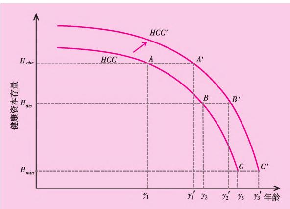

# 一、带着问题阅读

## 研究背景与理论框架

### 研究目标

1. **路径识别**：老年人健康恶化是随机过程还是存在可识别的主导路径？慢性病在其中是“催化剂”还是“必经站”？  
2. **因果识别**：慢性病与失能的高度相关是否为因果？示范区政策能否作为有效“因”降低失能风险这个“果”？  
3. **机制探究**：政策若有效，其作用“黑箱”为何？健康意识、就医行为还是疾病管理效果的改善？  
4. **异质性**：干预效果是否“一刀切”？在不同医疗资源与社会经济环境下是否存在显著差异？

# 二、理论框架与公式

## 健康资本存量动态方程

任一时期，个人的健康状况反映其健康资本存量，是由初始健康资本、后天健康投资，以及健康资本折旧（或损耗）共同决定的（Grossman，1972）[^Grossman1972]。

> **健康资本模型**
> 
> $$
> H_{t+1} = I_t + (1 - \delta_t) H_t
> $$

- $H_t$：当前健康资本存量  
- $I_t$：当期健康投资（锻炼、营养、医疗、健康教育等）  
- $\delta_t$：健康资本折旧率  
- $(1-\delta_t)H_t$：经历折旧后的存量部分。

## 折旧率函数

Fu 等（2016）[^Fu2016] 延拓了 Grossman 的研究框架，将健康环境、健康投资、年龄因素等引入折旧率函数的理论中：

$$
\delta_t = \delta(I_t, a_t) = \gamma_1 I_t^{\gamma_2} a_t^{\gamma_3}
$$

- $a_t$：年龄。假设年龄越大折旧越快且加速递增，即 $\frac{\partial \delta_t}{\partial a_t}>0$，$\gamma_3>1$。  
- $I_t$：健康投资。假设投资可减缓折旧但边际递减，即 $\frac{\partial \delta_t}{\partial I_t}<0$，$\gamma_2\in(-1,0)$。  
- $\gamma_1$：健康环境系数。当 $\gamma_1>1$（如污染、不良习惯、**患慢性病**）折旧放大；$0<\gamma_1<1$（良好公共卫生）折旧缩小。

> 本文将“患慢性病”视作使 $\gamma_1>1$ 的关键事件。患慢性病时，$\delta_t$ 跃升，由此  
> $ H_{t+1} = I_t + (1 - \delta_t) H_t$  
> 中 $H_{t+1}$ 加速耗尽，更快跌破失能阈值 $H_{\mathrm{dis}}$，说明“健康→慢性病→失能”的路径。

> **说明**：  
> $t$ 是时间索引，而 $a_t$ 是该时点的生理年龄，一般满足 $a_t = a_0 + t$。例如：  
> 2020 年（t=0）某个 60 岁个体的折旧率为  
> $$\delta_0 = \gamma_1 I_0^{\gamma_2} 60^{\gamma_3}$$

## 健康资本存量、健康状态与年龄的关系示意图

- $I$ 不变时，随着 $t$ 增长，$\delta$ 加速增长，从而 $H$ 加速下跌 → 健康恶化加速，失能风险上升。  
- $t$ 不变时，$I$ 变大，$\delta$ 变小，$H$ 下降延迟 → 早期预防可推迟并发症出现、延缓失能。

# 三、数据与模型（规律探寻）

## 健康状态转移模型：死亡风险模型（Logit）

**数据结构**

- $Y\in\{0=\mathrm{H},1=\mathrm{C},2=\mathrm{I},3=\mathrm{D}\}$，$X$为控制变量  
- 目标：估计 $P(Y_t|Y_{t-1})$ 以建立转移矩阵  

假设健康状态转移为时间齐次离散 Markov 过程：

$$
\text{logit}\big[P(Y_t=3|Y_{t-1},X)\big]=\alpha+\beta Y_{t-1}+\gamma X
$$

死亡（Y=3）为吸收态，因此 $Y_{t-1}\in\{0,1,2\}$。

> 展开后：
> $$
> \text{logit}\big[P(Y_t=3|Y_{t-1},X)\big]=\alpha+\beta_1 I_{Y_{t-1}=1}+\beta_2 I_{Y_{t-1}=2}+\gamma X
> $$

## 存活者健康状态转移模型：有序Logit

假设模型满足平行性假设：

$$
\text{logit}\big[P(Y_t>j|Y_{t-1},X)\big]=\alpha+\beta Y_{t-1}+\gamma X
$$

数学形式：
$$
\begin{aligned}
\text{logit}\big[P(Y_t>0)\big] &= \alpha_0+\beta Y_{t-1}+\gamma X \\
\text{logit}\big[P(Y_t>1)\big] &= \alpha_1+\beta Y_{t-1}+\gamma X
\end{aligned}
$$

$\alpha_0,\alpha_1$ 分别表示潜在变量门槛。

## 广义有序Logit

不满足平行性假设时：

$$
\text{logit}[P(Y_t>j|Y_{t-1},X)] = \alpha_j + \beta_j Y_{t-1} + \gamma X
$$

模型3（健康 vs 不健康）  
$$\text{logit}[P(Y_t>0)] = \alpha + \beta Y_{t-1} + \gamma X$$

模型4（失能 vs 健康+慢性病）  
$$\text{logit}[P(Y_t>1)] = \alpha + \beta Y_{t-1} + \gamma X$$

## 数据说明

- 样本：2018–2020 CHARLS 数据，8131人次，60岁及以上  
- 控制变量：
  - 年龄、性别、居住地、受教育程度、婚姻状况

# 四、结果（回归与转移矩阵）

## 参数估计结果

| 变量 | 模型1 Logit | 模型2 有序Logit | 模型3 广义有序Logit | 模型4 广义有序Logit |
|------|--------------|------------------|----------------------|----------------------|
| 年龄 | 0.076*** | 0.057*** | 0.014** | 0.067*** |
| 性别 | 0.816*** | -0.173*** | -0.188*** | -0.188*** |
| 居住地 | 0.011 | -0.212*** | -0.234*** | -0.234*** |
| 受教育 | -0.411* | -0.153 | -0.210* | -0.210* |
| 婚姻 | -0.393*** | 0.023 | 0.037 | 0.037 |
| 慢性病 | -0.12 | 3.169*** | 4.054*** | 0.575*** |
| 失能 | 1.155*** | 4.614*** | 3.749*** | 2.205*** |

> 模型2 切点值为 4.079、8.372；  
> *, **, *** 表示在 10%, 5%, 1% 水平显著。

## 状态转移矩阵（部分）

举例：  
$$
\mathbf{P}^{(60–64)} =
\begin{bmatrix}
0.6457 & 0.3313 & 0.0071 & 0.0159 \\
0.0731 & 0.7664 & 0.1461 & 0.0143 \\
0.0167 & 0.5204 & 0.4151 & 0.0478 \\
0      & 0      & 0      & 1
\end{bmatrix}
$$

说明：
- 健康→慢性病概率随年龄上升；
- 失能多由慢性病引致；
- 失能存在有限“可逆性”。

# 五、政策评估：慢性病综合防控与失能水平

## DID模型

$$
Disability_{ict} = \alpha + \beta (Treat_{ic}\times post_{it}) + \gamma X_{ict} + \eta_t + \delta_i + \lambda_c + \varepsilon_{ict}
$$

- $\beta$：政策净效应（核心）  
- $\eta_t$、$\delta_i$、$\lambda_c$：固定效应

## 基准回归结果

| 变量 | 模型5 | 模型6 | 模型7 |
|------|-------|-------|-------|
| Treat×Post | -0.057* | -0.060* | -0.067** |
| 婚姻状况 | — | -0.305*** | -0.304*** |
| 吸烟 | — | -0.480*** | -0.479*** |
| 是否有工资性收入 | — | -0.113*** | -0.111*** |
| 经济发展水平 | — | — | -0.223*** |

> 控制个体、地区、年份固定效应。  
> $N=49,269$，reghdfe 估计。  
> *, **, *** 为 10%, 5%, 1% 显著。

## 异质性分析

| 组别 | 医资丰富区 | 医资匮乏区 | 服务高质量区 | 服务低质量区 |
|------|-------------|-------------|---------------|---------------|
| Treat×Post | -0.046 | -0.118* | -0.154 | -0.061* |
| Adjusted-R² | 0.454 | 0.450 | 0.428 | 0.446 |

> 说明：政策在“补短板”场景更有效。

## 机制分析

| 因变量 | 系数（Treat×Post） | R² |
|---------|----------------------|----|
| 接受体检服务 | 0.035*** | 0.200 |
| 慢性病知晓 | 0.023** | 0.443 |
| 慢病管理 | 0.060*** | 0.558 |

> 政策提升慢病知晓率与自我管理，有助于降低失能风险。

# 六、总结与讨论

## 失能预防建议

1. 关口前移：监测老年人慢病风险，制定针对性预防方案。  
2. 全生命周期视角：学龄人群医教协同、阶段衔接。  
3. 优质资源下沉：财政支持向欠发达、农村与基层倾斜。

> 局限：
> - 缺少模型稳健性检验  
> - 数据期受政策/COVID影响  
> - 控制变量缺少医学相关变量（如遗传史、吸烟史等）

---

[^Grossman1972]: Grossman, M. (1972). *On the Concept of Health Capital and the Demand for Health*. Journal of Political Economy.
[^Fu2016]: Fu, et al. (2016). *Extension of Health Capital Depreciation Function*. Health Economics Research.
